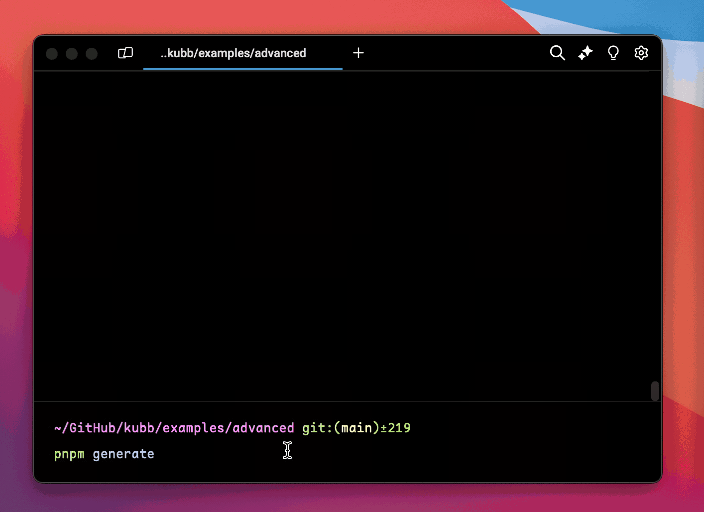

  

  <!-- <h1>Kubb</h1>

  

   OpenAPI to TypeScript, React-Query, Zod and Axios. 
  
 -->

<!-- Badges -->

 

   
<h4>
    <a href="https://codesandbox.io/s/github/kubb-project/kubb/tree/main/examples/simple">View Demo</a>
   · 
    <a href="https://kubb.dev/" target="_blank">Documentation</a>
   · 
    <a href="https://github.com/kubb-project/kubb/issues/">Report Bug</a>
   · 
    <a href="https://github.com/kubb-project/kubb/issues/">Request Feature</a>
  </h4>

 

## Features

* Generates Axios calls for every endpoint, with typed payload.
* Generates strong TypeScript types for every operation and property based on a specific OpenAPI specification.
* Generates Zod schemas for every operation and property based on a specific OpenAPI specification.
* Generates React-Query hook for every endpoint, with a typed payload based on the generated TypesScript types.
* Plugin system to create your own implementation of an existing package or create a new integration(Angular Clients, Solid-Query, ...). 

<!-- About the Project 
## :star2: About the Project

 
  

-->

## Contributors

<!-- ALL-CONTRIBUTORS-LIST:START - Do not remove or modify this section -->
<!-- prettier-ignore-start -->
<!-- markdownlint-disable -->

<!-- markdownlint-restore -->
<!-- prettier-ignore-end -->

<!-- ALL-CONTRIBUTORS-LIST:END -->

