# Resolver Architecture

> **Status**: ✅ IMPLEMENTED (Phase 1-2 Complete)
> **Last Updated**: 2026-02-06

## Overview

The **Resolver** system is a unified, type-safe abstraction that replaces the legacy `resolveName`, `resolvePath`, and `getSchemas` APIs.
It gives plugins and users a single entry point to control how operations and schemas map to file paths, artifact names, and output keys.

---

## Why Resolvers?

The legacy system had scattered resolution logic across 12 plugins, an awkward `type` parameter on every call, separate `getSchemas` helpers, and limited user customization via `transformers.name`.
The resolver system solves all of these by providing one unified call that returns **all** resolved names and file information at once.

---

## How It Works

### High-Level Flow


A **Resolver** receives an operation or schema as input and returns a **Resolution** — a default file plus a typed map of **Outputs** (each with a `name` and optional file override). Resolvers are executed in order; the first non-null result wins.

### Key Terms

| Term | Description |
|------|-------------|
| **Resolver** | Function that maps an operation/schema to a Resolution (or `null` to skip) |
| **Resolution** | Contains the default `file` and a typed `outputs` map |
| **Output** | A single artifact: `{ name, file? }` |
| **Output Keys** | Plugin-specific string literal union (e.g. `'type' \| 'request' \| 'response'`) |

---

## Resolver Chain & Priority

```mermaid
flowchart TD
  subgraph Plugin Setup
    U[User Resolvers] --> M[mergeResolvers]
    D[Default Resolver] --> M
  end
  M --> R["Merged Array<br/>[...user, ...default]"]
  R --> E[executeResolvers]

  subgraph Execution
    E --> R1[Resolver 1 — user]
    R1 -- null --> R2[Resolver 2 — user]
    R2 -- null --> R3[Resolver 3 — default]
    R3 -- Resolution --> OUT[Result]
    R1 -- Resolution --> OUT
    R2 -- Resolution --> OUT
  end
```



Custom resolvers are prepended, so they always get first priority. Returning `null` passes control to the next resolver in the chain.

---

## Plugin Integration

Each plugin defines its own **Output Keys** and wires a default resolver:


Output keys are defined as an **object** with `operation` and `schema` string unions per plugin — TypeScript enforces that every key is present in the returned `outputs` map:

```typescript
// Example: plugin-ts output keys
type PluginTsOutputKeys = {
  operation: 'query' | 'mutation' | 'pathParams' | 'queryParams' | 'headerParams'
    | 'request' | 'response' | 'responses' | 'responseData' | HttpStatus
  schema: 'type' | 'enum'
}
```

The `operation` handler must return outputs matching the `operation` keys, and the `schema` handler must return outputs matching the `schema` keys. The `default` key is always required in both.

| Plugin | Status | Operation Output Keys | Schema Output Keys |
|--------|--------|----------------------|-------------------|
| `plugin-ts` | ✅ Implemented | `query`, `mutation`, `pathParams`, `queryParams`, `headerParams`, `request`, `response`, `responses`, `responseData`, `HttpStatus` | `type`, `enum` |
| `plugin-react-query` | 🔄 Planned | — | — |

---

## Cross-Plugin Resolution

Plugins can query other plugins' resolvers via `useResolve` with a plugin name:


This enables `plugin-react-query` to import types generated by `plugin-ts` without hardcoding paths or names.

---

## User Customization

Users provide custom resolvers in plugin options. Three patterns are supported:

### 1. Full Override

Return a complete `Resolution` for every operation/schema:

```ts
import { createResolver } from '@kubb/plugin-oas/resolvers'

pluginTs({
  resolvers: [
    createResolver({
      name: 'my-resolver',
      operation: ({ operation }) => ({
        file: { baseName: `${name}.ts`, path: `types/${name}.ts`, ... },
        outputs: { default: { name }, query: { name: `${name}Query` }, response: { name: `${name}Response` }, ... }
      }),
    })
  ]
})
```

### 2. Partial Override (extend defaults)

Get the default resolution, then modify specific outputs:

```ts
import { createResolver } from '@kubb/plugin-oas/resolvers'

pluginTs({
  resolvers: [
    createResolver({
      name: 'prefix-types',
      operation: ({ operation, config }) => {
        const defaults = createTsResolver().operation({ operation, config })
        if (!defaults) return null
        return { ...defaults, outputs: { ...defaults.outputs,
          response: { ...defaults.outputs.response, name: `I${defaults.outputs.response.name}` }
        }}
      },
    })
  ]
})
```

### 3. Conditional Override

Return `null` to skip and fall through to the next resolver:

```ts
import { createResolver } from '@kubb/plugin-oas/resolvers'

pluginTs({
  resolvers: [
    createResolver({
      name: 'admin-only',
      operation: ({ operation }) => {
        if (!operation.path.startsWith('/admin')) return null
        // custom logic for admin endpoints only
      },
    })
  ]
})
```

---

## Backwards Compatibility

The system is fully backwards-compatible. When `useResolve` returns `null` (no resolvers configured), callers fall back to the legacy `resolveName`/`resolvePath` APIs. Old configs continue to work without changes.


---

## Implementation Status

| Phase | Status | Description |
|-------|--------|-------------|
| 1. Infrastructure | ✅ Complete | Types, `createResolver`, `mergeResolvers`, `executeResolvers`, `useResolve` hook in `@kubb/plugin-oas` |
| 2. plugin-ts | ✅ Complete | `createTsResolver`, output keys, generators use `useResolve`, 138 tests passing |
| 3. Other plugins | 🔄 Planned | `plugin-zod`, `plugin-client`, query plugins, `plugin-faker`, `plugin-msw` |
| 4. Documentation | 📝 In Progress | Architecture doc (this), user guide, migration guide |
| 5. Deprecation | 🔮 Future (v5) | Deprecate and remove legacy `resolveName`/`resolvePath` |

---

## Future Enhancements

- **Resolver Composition** — `composeResolvers(prefixResolver('I'), groupByTagResolver())`
- **Pre-built Helpers** — `prefixResolver`, `suffixResolver`, `groupByTagResolver`
- **Caching** — `withCache(resolver)` for performance
- **Debug Mode** — `withDebug(resolver)` for logging
