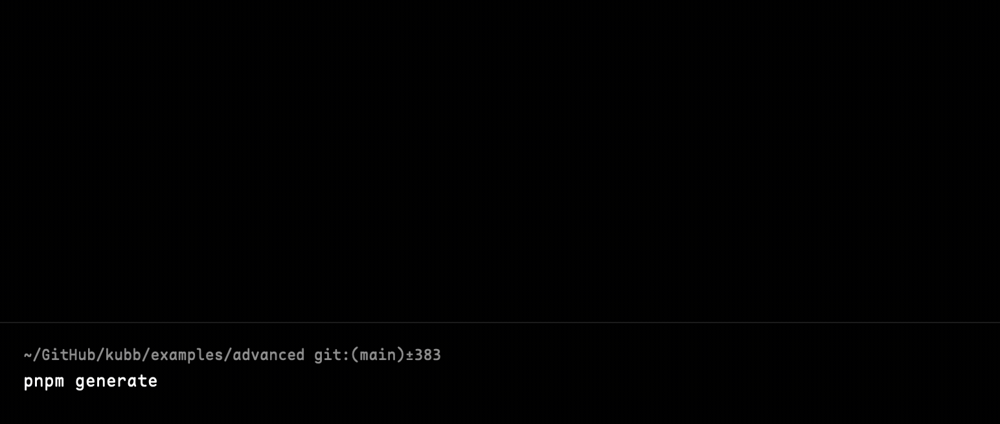

# @kubb/cli

The Kubb CLI allows you to generate files based on the `kubb.config.ts` configuration file.
The CLI displays progress updates showing plugin execution status, file counts, and timing information throughout the generation process.



## Installation

::: code-group
```shell [bun]
bun add -d @kubb/cli
```

```shell [pnpm]
pnpm add -D @kubb/cli
```

```shell [npm]
npm install --save-dev @kubb/cli
```

```shell [yarn]
yarn add -D @kubb/cli
```
:::

## Usage

```shell [node]
kubb --config kubb.config.js
```

```mdx
USAGE kubb generate

COMMANDS
  generate    [input] Generate files based on a 'kubb.config.ts' file
  validate    Validate a Swagger/OpenAPI file
  mcp         Start the server to enable the MCP client to interact with the LLM.

Use kubb <command> --help for more information about a command.
```

## Progress Display

During generation, the CLI shows progress updates after each major step:

- After each plugin completes: `◇ Plugins 3/5 | 2100ms`
- After file writing completes: `◇ Plugins 5/5 | Files 18/18 | 320ms`
- With failed plugins: `◇ Plugins 3/5 (1 failed) | Files 18/18 | 450ms`

This provides at-a-glance visibility into the generation progress, similar to test runners like Vitest and Jest.

## `kubb generate`
Generate files based on a `kubb.config.ts` file

> [!TIP]
> `kubb generate` and `kubb` will call the same generate functionality.

```mdx
USAGE kubb generate [OPTIONS]

OPTIONS

                        -c, --config    Path to the Kubb config
  -l, --logLevel=<silent|info|verbose|debug>    Log level control
                         -w, --watch    Watch mode based on the input file
                         -v, --verbose  Override logLevel to verbose (shows plugin timings)
                         -s, --silent   Override logLevel to silent (shows plugin timings)
                         -d, --debug    Override logLevel to debug (shows all details)
                          -h, --help    Show help
```

Path of the input file(overrides the one in `kubb.config.js`)

```shell [node]
kubb petStore.yaml
```

### Options

#### --config (-c)

Path to the Kubb config.

```shell [node]
kubb --config kubb.config.ts
```

#### --log-level (-l)
- `silent` suppresses all log messages, warnings, and errors.
- `info` logs warnings, errors, and informational messages (default).
- `verbose` adds plugin timing breakdown and performance metrics.
- `debug` shows all messages from `verbose` plus detailed execution traces.

```shell [node]
kubb --log-level verbose
```

#### --verbose (-v)

Enables verbose logging with plugin performance metrics. Shows a breakdown of plugin execution times in the summary, similar to what tools like Vite and NX display.

Output includes:
- Plugin timing breakdown with visual bars
- Performance metrics for slowest plugins
- All info-level messages

```shell [node]
kubb --verbose
```

Example output:
```
Plugin Timings:
  ████████████ plugin-oas: 1.19s
  ██ plugin-ts: 194ms
```

#### --debug
> [!TIP]
> Debug mode creates detailed log files in the `.kubb` directory:
> - `.kubb/kubb-{name}-{timestamp}.log` - Contains all debug messages with timestamps
>
> After each generation completes, the CLI will display the exact location of the debug log file.

Debug mode provides comprehensive logging including:
- Setup phase details (configuration, plugins, paths)
- Plugin installation and execution timing
- Hook execution with duration measurements
- Schema parsing information
- File generation progress with paths
- Formatter/linter execution details
- Error messages with full stack traces

This is extremely useful for:
- Troubleshooting generation issues
- Understanding plugin execution flow
- Performance analysis
- Debugging schema parsing problems

Alias for `kubb generate --log-level debug`
```shell [node]
kubb --debug
```

See the [Debugging Guide](/knowledge-base/debugging) for more details on using debug mode.

#### --watch (-w)

Watch mode based on the input file.
```shell [node]
kubb --watch
```

#### --version (-v)

Output the version number.

```shell [node]
kubb --version
```

#### --help (-h)
Display the help.

```shell [node]
kubb --help
```

## `kubb validate`
The command will check for syntax and structural errors in your Swagger/OpenAPI file, and provide clear feedback (errors/warnings).

Useful for CI pipelines, pre-commit hooks, and early feedback in development

> [!IMPORTANT]
> `@kubb/oas` should be installed


> [!TIP]
> Behind the scenes we are using `oas-normalize` to validate your Swagger/OpenAPI file.

```mdx
USAGE kubb validate [OPTIONS]

OPTIONS

  -i, --input    Path to Swagger/OpenAPI file
   -h, --help    Show help
```

### Options

#### --input (-i)

Path to your Swagger/OpenAPI file
```shell [node]
kubb generate --input
```

## `kubb mcp`
Start a [Model Context Protocol (MCP)](https://modelcontextprotocol.io) server to enable AI assistants like [Claude](https://claude.ai), [Cursor](https://cursor.sh), and other MCP-compatible tools to interact with Kubb through natural language.

The MCP server exposes Kubb's code generation functionality through the Model Context Protocol, allowing AI assistants to generate code from OpenAPI specifications using conversational commands.

> [!IMPORTANT]
> `@kubb/mcp` should be installed to use this command.

::: code-group
```shell [bun]
bun add -d @kubb/mcp
```

```shell [pnpm]
pnpm add -D @kubb/mcp
```

```shell [npm]
npm install --save-dev @kubb/mcp
```

```shell [yarn]
yarn add -D @kubb/mcp
```
:::

### Usage

```shell [node]
npx kubb mcp
```

This starts an MCP server that communicates via stdio (standard input/output), making it compatible with MCP clients like [Claude Desktop](https://claude.ai/download), [Cursor](https://cursor.sh), and other MCP-compatible tools.

For more information about configuring MCP for Kubb, see [using Kubb MCP](./mcp.md).
