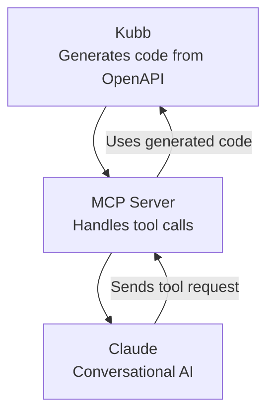
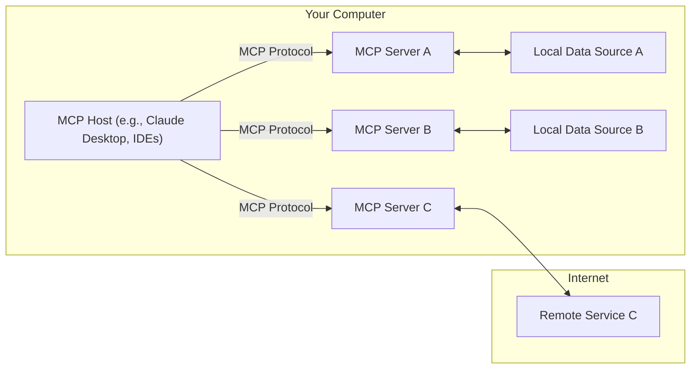

# Setup Claude with Kubb <a href="/plugins/plugin-mcp"><Badge type="info" text="@kubb/plugin-mcp" /></a>


[Kubb](https://kubb.dev), [Claude](https://claude.ai), and [MCP (Model Context Provider)](https://modelcontextprotocol.io) work together to streamline API interactions with conversational AI.

- **Kubb** generates type-safe code from OpenAPI specs, automating the creation of necessary API files, Zod schemas and the necessary files for setting up an MCP server.

- **Claude**, a conversational AI, uses [MCP](https://modelcontextprotocol.io) to seamlessly interact with these APIs, handling requests through natural dialogues.

- **MCP** ensuring Claude maintains a relevant and coherent conversation while interacting with your backend.

> _"Together, they provide a powerful and efficient way to automate API calls and build intelligent, conversational applications."_





## Installation
Before you can use [Claude](https://claude.ai), you need to install [Claude desktop](https://claude.ai/download) and follow the following tutorial: [https://modelcontextprotocol.io/quickstart/user](https://modelcontextprotocol.io/quickstart/user).

Additionally, you’ll need to install Kubb with the [MCP plugin](/plugins/plugin-mcp).

> [!IMPORTANT]
> Minimal Kubb version of `v3.10.0`.

> [!TIP]
> Our MCP plugin uses the Oas, TypeScript and Zod plugin to create all the files needed.

::: code-group
```shell [bun]
bun add -d @kubb/plugin-mcp @kubb/plugin-oas @kubb/plugin-ts @kubb/plugin-zod
```

```shell [pnpm]
pnpm add -D @kubb/plugin-mcp @kubb/plugin-oas @kubb/plugin-ts @kubb/plugin-zod
```

```shell [npm]
npm install --save-dev @kubb/plugin-mcp @kubb/plugin-oas @kubb/plugin-ts @kubb/plugin-zod
```

```shell [yarn]
yarn add -D @kubb/plugin-mcp @kubb/plugin-oas @kubb/plugin-ts @kubb/plugin-zod
```
:::

## Define a `kubb.config.ts`
To use [Claude](https://claude.ai), we need to define a `kubb.config.ts` file that will contain the setup and configuration of your [MCP](https://modelcontextprotocol.io) server.

> [!IMPORTANT]
> It is important to define your `baseURL` so **Claude** knows which endpoints to call.

```typescript{1} twoslash
import { defineConfig } from '@kubb/core'
import { pluginOas } from '@kubb/plugin-oas'
import { pluginTs } from '@kubb/plugin-ts'
import { pluginMcp } from '@kubb/plugin-mcp'
import { pluginZod } from '@kubb/plugin-zod'

export default defineConfig({
  input: {
    path: './petStore.yaml',
  },
  output: {
    path: './src/gen',
  },
  plugins: [
    pluginOas(),
    pluginTs(),
    pluginMcp({
      client: {
        baseURL: 'https://petstore.swagger.io/v2', // [!code ++]
      },
    }),
  ],
})
```

## Generate MCP related files
Run the following command to create the desired files.
```shell
npx kubb generate
```

## Inspect the generated files
In this examples, we will focus on the `src/mcp` folder, containing the generated files that we will use to create an [MCP server](https://modelcontextprotocol.io) and provide [Claude](https://claude.ai/download) with a link to your APIs.

```
.
├── src/
│   └── mcp/
│   │   ├── addPet.ts
│   │   └── getPet.ts
│   │   └── mcp.json
│   │   └── server.ts
│   └── zod/
│   │   ├── addPetSchema.ts
│   │   └── getPetSchema.ts
│   └── models/
│   │   ├── AddPet.ts
│   │   └── GetPet.ts
│   └── index.ts
├── petStore.yaml
├── kubb.config.ts
└── package.json
```

### src/mcp/addPet.ts
The `addPetHandler` function sends a POST request to the **Swagger Petstore API** to add a new pet.
It takes pet data as input, handles the response, and returns it as a JSON-formatted message for [MCP](https://modelcontextprotocol.io) to use in a conversation.

```typescript [src/mcp/addPet.ts]
import client from "@kubb/plugin-clients/client/axios"
import type { AddPetMutationRequest, AddPetMutationResponse, AddPet405 } from '../models/AddPet'
import type { CallToolResult } from '@modelcontextprotocol/sdk/types'

export async function addPetHandler({ data }: { data: AddPetMutationRequest }): Promise<Promise<CallToolResult>> {
  const res = await client<AddPetMutationResponse, ResponseErrorConfig<AddPet405>, AddPetMutationRequest>({
    method: 'POST',
    url: '/pet',
    baseURL: 'https://petstore.swagger.io/v2',
    data,
  })
  return {
    content: [
      {
        type: 'text',
        text: JSON.stringify(res.data),
      },
    ],
  }
}
```

### src/mcp/mcp.json
This configuration sets up an [MCP](https://modelcontextprotocol.io) server named `"Swagger Petstore - OpenAPI 3.0”`, uses `info.title` from your OpenAPI/Swagger file.

It runs a TypeScript server (`server.ts`) using the `tsx` command, enabling [MCP](https://modelcontextprotocol.io) to handle API-related tool calls via standard input/output.
```JSON [src/mcp/mcp.json]
{
  "mcpServers": {
    "Swagger Petstore - OpenAPI 3.0": {
      "type": "stdio",
      "command": "npx",
      "args": ["tsx", "/mcp/src/gen/mcp/server.ts"]
    }
  }
}


```

### src/mcp/server.ts
This code sets up and starts an [MCP](https://modelcontextprotocol.io) server that listens for tool calls to `"add a pet to the store"` via the `"Swagger Petstore API"`(your OpenAPI/Swagger file).

1.	It imports necessary classes from the [MCP](https://modelcontextprotocol.io) SDK and the custom addPetHandler function.
2.	It creates an [MCP](https://modelcontextprotocol.io) server named “Swagger Petstore - OpenAPI 3.0”.
3.	It registers a tool (`addPet`) with the server that triggers the `addPetHandler` when called, expecting the pet data in the form defined by `addPetMutationRequestSchema`(generated by the Zod plugin).
4.	The `startServer` function connects the server to a `stdio transport`, meaning it will communicate through standard input/output. If successful, [Claude](https://claude.ai) could interact with your API.

In short, this code sets up an [MCP](https://modelcontextprotocol.io) server that processes API requests to 'add a new pet' by using the `addPetHandler`.
```typescript [src/mcp/server.ts]
import { McpServer } from '@modelcontextprotocol/sdk/server/mcp'
import { StdioServerTransport } from '@modelcontextprotocol/sdk/server/stdio'

import { addPetHandler } from './addPet'
import { addPetMutationRequestSchema } from '../zod/addPetSchema'

export const server = new McpServer({
  name: 'Swagger Petstore - OpenAPI 3.0',
  version: '3.0.3',
})


server.tool('addPet', 'Add a new pet to the store', { data: addPetMutationRequestSchema }, async ({ data }) => {
  return addPetHandler({ data })
})

async function startServer() {
  try {
    const transport = new StdioServerTransport()
    await server.connect(transport)
    console.log('Server started and listening on stdio')
  } catch (error) {
    console.error('Failed to start server:', error)
    process.exit(1)
  }
}

startServer()
```

## Starting Claude with the generated MCP server

Before you can get started, you need to let [Claude](https://claude.ai) know where your [MCP](https://modelcontextprotocol.io) server config file is located(`src/mcp/mcp.json`).
For that you need to open `Claude desktop` and go to `settings`.


This will open the settings panel. From there, go to the `developer` section and click on `edit config`.
A window will then appear showing the location of the JSON file that contains all the [MCP](https://modelcontextprotocol.io) servers.

> [!TIP]
> Our manually go to the following folder:
> - Mac: `~/Library/Application Support/Claude/claude_desktop_config.json`
> - Windows: `%APPDATA%\Claude\claude_desktop_config.json`


You can now copy the content of `src/mcp/mcp.json` to make [Claude](https://claude.ai) aware of your [MCP](https://modelcontextprotocol.io) server.

> [!TIP]
> If you’re using multiple MCP servers, remember to append the config instead of overriding it.

For example:
```JSON [~/Library/Application Support/Claude/claude_desktop_config.json]
{
  "mcpServers": {
    "Swagger Petstore - OpenAPI 3.0": {
      "type": "stdio",
      "command": "npx",
      "args": ["tsx", "mcp/src/gen/mcp/server.ts"]
    },
    "github": {
      "command": "docker",
      "args": [
        "run",
        "-i",
        "--rm",
        "-e",
        "GITHUB_PERSONAL_ACCESS_TOKEN",
        "mcp/github"
      ],
      "env": {
        "GITHUB_PERSONAL_ACCESS_TOKEN": "<YOUR_TOKEN>"
      }
    }
  }
}
```

## Validate if your MCP server runs
First of all, stop [Claude](https://claude.ai) and reopen the desktop application again.

After that, you can validate if your [MCP](https://modelcontextprotocol.io) server is connected and working by clicking on the following button.


This will open the following view where you could see our generated [MCP](https://modelcontextprotocol.io) server.


## Start using your MCP server
In your example we will use the prompt `create a random pet` that will call our generated [MCP](https://modelcontextprotocol.io) server.
The [MCP](https://modelcontextprotocol.io) server will attach that to the tool `addPet` which will then call `addPetHandler` and create our pet.


## Links

- [MCP setup](https://modelcontextprotocol.io)
- [Claude](https://claude.ai)
