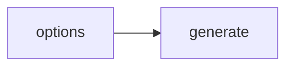
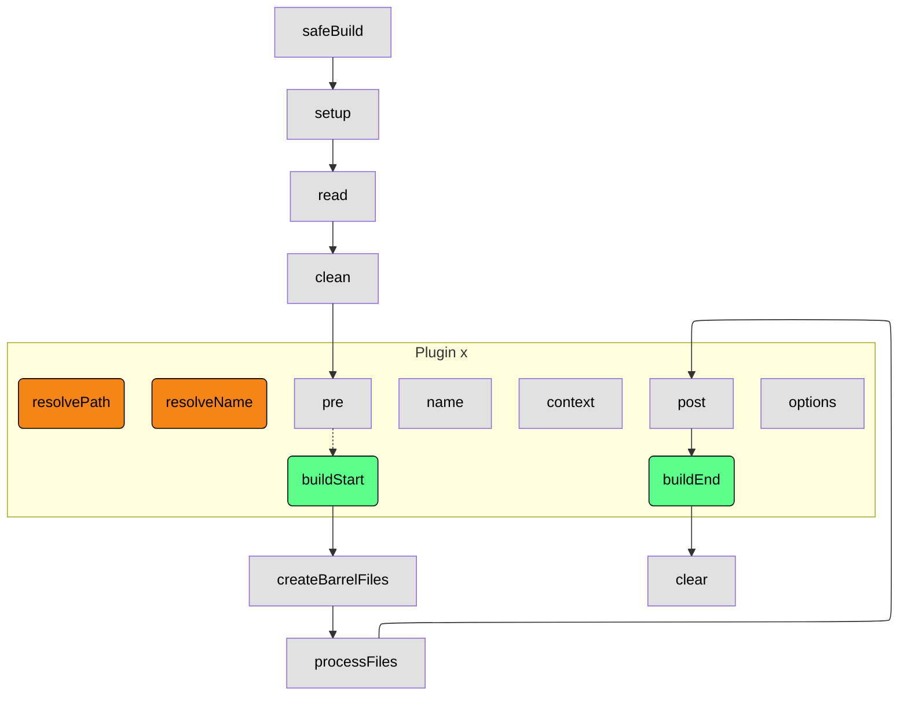
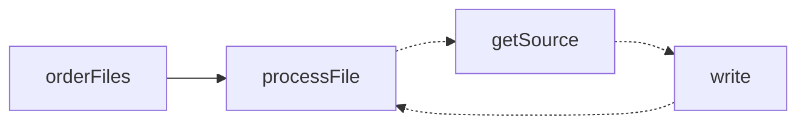

# Plugins

[[toc]]

## Pre plugin

```mermaid
flowchart LR
  options --> generate
```

	

		hookFirst
	

	

		hookForPlugin
	

	

		hookParallel
	

	

		hookSeq
	

```mermaid
---
config:
  layout: elk
---
flowchart
  classDef default fill:#e1e1e1, color:#000;
  classDef hookFirst fill:#ff6565,stroke:#000;
  classDef hookForPlugin fill:#f58517,stroke:#000;
  classDef hookParallel fill:#5bff89,stroke:#000;
  classDef hookSeq fill:#ffee55,stroke:#f00;

  buildEnd("buildEnd"):::hookParallel
  click buildEnd "#buildend" _parent

  buildStart("buildStart"):::hookParallel
  click buildStart "#buildstart" _parent

  resolvePath("resolvePath"):::hookForPlugin
  click resolvePath "#resolvePath" _parent

  resolveName("resolveName"):::hookForPlugin
  click resolveName "#resolveName" _parent

  safeBuild
--> setup
--> read
--> clean
--> pre

buildStart
--> createBarrelFiles
--> processFiles
--> post
--> buildEnd
--> clear

subgraph plugin[ Plugin x ]
pre
.-> buildStart

name
options
pre
post
context
resolvePath
resolveName
buildEnd
buildStart
end
```

```mermaid
flowchart LR
  orderFiles
  --> processFile
  .-> getSource
  .-> write
  .-> processFile
```
