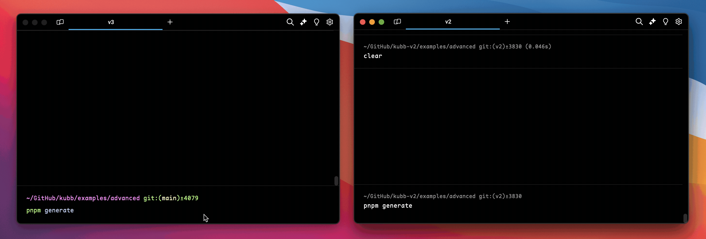

# Migrating to Kubb v5

## Breaking Changes

### Node.js 22 required

Kubb v5 requires **Node.js 22** or later.

### Factory functions renamed: `define*` → `create*`

`defineConfig` is unchanged. All other factory functions now use the `create*` prefix.

::: code-group
```typescript [Before]
import { definePlugin, defineAdapter, defineLogger, defineGenerator, defineStorage } from '@kubb/core'

export const myPlugin = definePlugin((options) => ({ /* ... */ }))
export const myAdapter = defineAdapter((options) => ({ /* ... */ }))
export const myLogger = defineLogger({ name: 'my-logger', install() { /* ... */ } })
export const myGenerator = defineGenerator({ /* ... */ })
export const myStorage = defineStorage((options) => ({ /* ... */ }))
```

```typescript [After]
import { createPlugin, createAdapter, createLogger, createGenerator, createStorage } from '@kubb/core'

export const myPlugin = createPlugin((options) => ({ /* ... */ }))
export const myAdapter = createAdapter((options) => ({ /* ... */ }))
export const myLogger = createLogger({ name: 'my-logger', install() { /* ... */ } })
export const myGenerator = createGenerator({ /* ... */ })
export const myStorage = createStorage((options) => ({ /* ... */ }))
```
:::

### Each plugin can only be used once

Adding the same plugin twice will throw an error.

```typescript
// ❌ No longer allowed
export default defineConfig({
  plugins: [pluginTs({}), pluginTs({})],
})

// ✅ Use a single instance
export default defineConfig({
  plugins: [pluginTs({})],
})
```

### `PluginManager` renamed to `PluginDriver`

Affects custom plugin and generator authors.

::: code-group
```typescript [Before]
import { PluginManager } from '@kubb/core'
import { usePluginManager } from '@kubb/core/hooks'

// In a generator or plugin context:
meta.pluginManager
```

```typescript [After]
import { PluginDriver } from '@kubb/core'
import { usePluginDriver } from '@kubb/core/hooks'

// In a generator or plugin context:
meta.driver
```
:::

### Object and JSON plugin formats removed

Only the array-of-plugin-instances format is supported.

::: code-group
```typescript [Before (object style)]
export default defineConfig({
  plugins: { '@kubb/plugin-ts': {} },
})
```

```typescript [Before (array tuple)]
export default defineConfig({
  plugins: [['@kubb/plugin-ts', {}]],
})
```

```typescript [After]
import { pluginTs } from '@kubb/plugin-ts'

export default defineConfig({
  plugins: [pluginTs({})],
})
```
:::

### `mapper` replaced by `transformers` in `@kubb/plugin-ts`

The `mapper` option (`Record<string, ts.PropertySignature>`) has been removed. Use the new `transformers` array to modify AST nodes before they are printed to TypeScript. Transformers are more powerful — they can modify, replace, or remove any schema or property node, not just override individual property signatures.

::: code-group
```typescript [Before (v4) — mapper]
import { defineConfig } from '@kubb/core'
import { pluginTs } from '@kubb/plugin-ts'
import ts from 'typescript'

const factory = ts.factory

export default defineConfig({
  plugins: [
    pluginTs({
      mapper: {
        // Override the "category" property to always be a string
        category: factory.createPropertySignature(
          undefined,
          factory.createIdentifier('category'),
          factory.createToken(ts.SyntaxKind.QuestionToken),
          factory.createKeywordTypeNode(ts.SyntaxKind.StringKeyword),
        ),
      },
    }),
  ],
})
```

```typescript [After (v5) — transformers]
import { defineConfig } from '@kubb/core'
import { pluginTs } from '@kubb/plugin-ts'

export default defineConfig({
  plugins: [
    pluginTs({
      transformers: [
        {
          // Override the "category" property to use a string schema and make it optional
          property(node) {
            if (node.name === 'category') {
              return {
                ...node,
                required: false,
                schema: { ...node.schema, kind: 'Schema', type: 'string' },
              }
            }
          },
        },
      ],
    }),
  ],
})
```
:::

Transformers operate on `@kubb/ast` nodes (`SchemaNode`, `PropertyNode`, `OperationNode`, etc.) instead of raw TypeScript AST nodes. This removes the `typescript` peer dependency and makes transformations portable across output formats.

Common migration patterns:

```typescript
pluginTs({
  transformers: [
    {
      // Remove a property entirely (return undefined to skip it)
      property(node) {
        if (node.name === 'internalId') {
          return { ...node, schema: { ...node.schema, kind: 'Schema', type: 'never' } }
        }
      },
    },
    {
      // Force all date types to plain strings
      schema(node) {
        if (node.type === 'date') {
          return { ...node, type: 'string', representation: 'string' }
        }
      },
    },
    {
      // Add a JSDoc description to a specific schema
      schema(node) {
        if (node.name === 'Pet') {
          return { ...node, description: 'Represents a pet in the store.' }
        }
      },
    },
  ],
})
```

#### Using `context.parent` for scoped transformations

Every transformer callback receives a second argument — a `context` object with a type-safe `parent` field. This lets you scope transformations to properties of a specific schema, parameters of a specific operation, or any other parent-child relationship in the AST.

The `parent` type is automatically narrowed based on the visitor callback:

| Callback      | `context.parent` type                                                              |
| ------------- | ---------------------------------------------------------------------------------- |
| `root()`      | `undefined` (root has no parent)                                                   |
| `operation()` | `RootNode`                                                                         |
| `schema()`    | `RootNode \| OperationNode \| SchemaNode \| PropertyNode \| ParameterNode \| ResponseNode` |
| `property()`  | `SchemaNode`                                                                       |
| `parameter()` | `OperationNode`                                                                    |
| `response()`  | `OperationNode`                                                                    |

```typescript
pluginTs({
  transformers: [
    {
      // Make all properties of the "Pet" schema optional
      property(node, { parent }) {
        if (parent?.name === 'Pet') {
          return { ...node, required: false }
        }
      },
    },
    {
      // Remove writeOnly properties, but only inside response schemas
      property(node, { parent }) {
        if (parent?.kind === 'Schema' && node.schema.writeOnly) {
          return { ...node, schema: { ...node.schema, kind: 'Schema', type: 'never' } }
        }
      },
    },
    {
      // Override a nested schema inside a specific operation's request body
      schema(node, { parent }) {
        if (parent?.kind === 'Operation' && parent.operationId === 'createPet' && node.type === 'date') {
          return { ...node, type: 'string' }
        }
      },
    },
  ],
})
```

Use `composeTransformers` from `@kubb/ast` to combine multiple visitors into one when building reusable transformer presets.

### `@kubb/plugin-ts` options moved to `adapterOas`

These options no longer exist on `pluginTs(...)` — pass them to `adapterOas(...)` instead.

::: code-group
```typescript [Before]
import { defineConfig } from '@kubb/core'
import { pluginTs } from '@kubb/plugin-ts'

export default defineConfig({
  plugins: [
    pluginTs({
      enumSuffix: 'enum',
      dateType: 'date',
      integerType: 'bigint',
      unknownType: 'unknown',
      emptySchemaType: 'unknown',
    }),
  ],
})
```

```typescript [After]
import { defineConfig } from '@kubb/core'
import { adapterOas } from '@kubb/adapter-oas'
import { pluginTs } from '@kubb/plugin-ts'

export default defineConfig({
  plugins: [
    adapterOas({
      enumSuffix: 'enum',
      dateType: 'date',
      integerType: 'bigint',
      unknownType: 'unknown',
      emptySchemaType: 'unknown',
    }),
    pluginTs(),
  ],
})
```
:::

### Enum naming changed (`collisionDetection`)

`collisionDetection` defaults to `true` in v5 (was `false` in v4). This changes how nested enum names are generated.

| Mode | Example |
|---|---|
| `true` (default, v5) | `OrderParamsStatusEnum` |
| `false` (v4 behavior) | `ParamsStatusEnum` |

To keep v4 behavior:

```typescript
import { defineConfig } from '@kubb/core'
import { adapterOas } from '@kubb/adapter-oas'

export default defineConfig({
  plugins: [
    adapterOas({ collisionDetection: false }),
  ],
})
```

### Backwards-compatible type naming (`legacy` option)

If your code relies on v4 operation type names, set `legacy: true` in `pluginTs` while you migrate.

```typescript
import { defineConfig } from '@kubb/core'
import { pluginTs } from '@kubb/plugin-ts'

export default defineConfig({
  plugins: [
    pluginTs({ legacy: true }),
  ],
})
```

| Type | v5 default | `legacy: true` |
|---|---|---|
| Request body | `<OperationId>Data` | `<OperationId>MutationRequest` / `QueryRequest` |
| Response union | `<OperationId>Response` | `<OperationId>MutationResponse` / `QueryResponse` |
| All responses | `<OperationId>Responses` | `<OperationId>Mutation` / `Query` |
| Response status | `<OperationId>Status201` | `<OperationId>201` |
| Default/error | `<OperationId>StatusDefault` | `<OperationId>Error` |

### `transformers.name` removed from `@kubb/plugin-ts`

The `transformers: { name }` callback has been removed. Use a custom resolver in the new `resolvers` array instead.

::: code-group
```typescript [Before (v4)]
import { defineConfig } from '@kubb/core'
import { pluginTs } from '@kubb/plugin-ts'

export default defineConfig({
  plugins: [
    pluginTs({
      transformers: {
        name: (name, type) => type === 'type' ? `${name}Type` : name,
      },
    }),
  ],
})
```

```typescript [After (v5)]
import { defineConfig } from '@kubb/core'
import { defineResolver } from '@kubb/core'
import { pluginTs } from '@kubb/plugin-ts'
import { resolverTs } from '@kubb/plugin-ts/resolvers'

export default defineConfig({
  plugins: [
    pluginTs({
      resolvers: [
        resolverTs,
        defineResolver(() => ({
          ...resolverTs,
          name: 'custom',
          default(name, type) {
            const resolved = resolverTs.default(name, type)
            return type === 'type' ? `${resolved}Type` : resolved
          },
        })),
      ],
    }),
  ],
})
```
:::

### Composable resolvers for `@kubb/plugin-ts`

The `resolvers` option accepts an array of named resolvers that control naming conventions. Later entries override earlier ones.

```typescript
import { pluginTs, resolverTs, resolverTsLegacy } from '@kubb/plugin-ts'

// Use legacy naming conventions
pluginTs({ resolvers: [resolverTsLegacy] })

// Use default naming (equivalent to omitting the option)
pluginTs({ resolvers: [resolverTs] })
```

The `mergeResolvers` helper from `@kubb/core` merges multiple resolvers into a single resolver where later entries override earlier ones.

### AST transformers for `@kubb/plugin-ts`

The `transformers` option accepts an array of AST `Visitor` objects. These visitors modify `SchemaNode` trees before they are printed to TypeScript. Use this to customize the generated types without writing a custom generator.

```typescript
import { pluginTs } from '@kubb/plugin-ts'

pluginTs({
  transformers: [
    {
      // Force all date types to plain strings
      schema(node) {
        if (node.type === 'date') {
          return { ...node, type: 'string' }
        }
      },
    },
    {
      // Make specific properties optional
      property(node) {
        if (node.name === 'metadata') {
          return { ...node, required: false }
        }
      },
    },
  ],
})
```

The `composeTransformers` helper from `@kubb/ast` combines multiple `Visitor` objects into a single visitor that pipes each node through all visitors sequentially.

### `defineResolver` now requires a `name` property

Plugin resolvers created with `defineResolver` must include a `name` property in the returned object. This identifies the resolver in the `resolvers` array.

::: code-group
```typescript [Before (v4)]
import { defineResolver } from '@kubb/core'

export const myResolver = defineResolver(() => ({
  resolveName(name) { return name },
}))
```

```typescript [After (v5)]
import { defineResolver } from '@kubb/core'

export const myResolver = defineResolver(() => ({
  name: 'my-resolver',
  resolveName(name) { return name },
}))
```
:::

### Path parameters with `$ref` schemas now resolve to their named type

In v4, a path parameter whose `schema` was a `$ref` was incorrectly typed as `any`. In v5 the referenced type name is used instead.

::: code-group
```typescript [Before (v4 — typed as any)]
// OpenAPI spec
// parameters:
//   - name: petId
//     in: path
//     required: true
//     schema:
//       $ref: '#/components/schemas/PetId'

// Generated type (v4)
export type GetPetByIdPathParams = {
  petId: any
}
```

```typescript [After (v5 — typed correctly)]
// Generated type (v5)
export type GetPetByIdPathParams = {
  petId: PetId
}
```
:::

This is a correctness fix. If you were relying on the `any` type for path parameters that reference a `$ref` schema, update your code to use the referenced type.

# Migrating to Kubb v3

## New Features

### Static Class Client

You can now generate API clients as classes with static methods using `clientType: 'staticClass'` in `@kubb/plugin-client`. This allows you to call API methods directly on the class without instantiating it:

```typescript
// Before
const client = new Pet()
await client.getPetById({ petId: 1 })

// After
await Pet.getPetById({ petId: 1 })
```

See the plugin-client documentation for details and usage notes.

### Generators

> [!TIP]
> Generators are a replacements of `templates`

See [Generators](/guide/generators).

### kubb.config.ts
2 extra options have been added to the output:
#### `output.extension`
In the latest [Node.js](https://nodejs.org/api/esm.html#mandatory-file-extensions) version, file extensions are required, so we automatically add `.ts` to every file. However, not all projects use the latest Node.js configuration for extensions. With this option, you can remove the extension or use `.js` instead.

See [output.extension](/getting-started/configure#output-extension).

#### `output.barrelType`
Specify how `index.ts` files should be created, this will work for the root `index.ts` file. On plugin level there is also a new option to define this.

See [output.barrelType](/getting-started/configure#output-barreltype).

### Rewrite of the CLI
|          |           |
| -------: | :-------- |
| Left: v3 | Right: v2 |


The CLI and core have been revamped for improved speed and in v3 it will also display more relevant information.
- Progressbar for the execution of plugins.
- Progressbar for the writing of files.
- Timestamps next to every command that is being executed.
- Better support for CI tools
- Use of TypeScript Strict
- 20-30% faster overall execution
- [Debug mode(`--debug`)](helpers/cli#debug) that will create 2 log files
  - `.kubb/kubb-DATE_STRING.log`
  - `.kubb/kubb-files.log`
- All issues can be seen here: [Kubb v3 ideas](https://github.com/kubb-labs/kubb/issues/1115)


## Breaking Changes

### Plugin renames
We previously used the name swagger to indicate that we only supported Swagger files. However, we now also support OpenAPI v3 and v3.1. This change allows for the potential integration of additional specifications beyond just OpenAPI files in the future.

> [!TIP]
> Default imports are also being removed in v3 so you need to import a plugin as follow(support for better treeshaking for ESM):
>
> `import { pluginReactQuery } from '@kubb/plugin-react-query'`

- `@kubb/swagger-client` becomes `@kubb/plugin-client`
- `@kubb/swagger-faker` becomes `@kubb/plugin-faker`
- `@kubb/swagger-msw` becomes `@kubb/plugin-msw`
- `@kubb/swagger` becomes `@kubb/plugin-oas`
- `@kubb/plugin-tanstack-query` becomes `@kubb/plugin-react-query` for [React](https://react.dev/)
- `@kubb/plugin-tanstack-query` becomes `@kubb/plugin-solid-query` for [Solid](https://www.solidjs.com/)
- `@kubb/plugin-tanstack-query` becomes `@kubb/plugin-svelte-query` for [Svelte](https://svelte.dev/)
- `@kubb/plugin-tanstack-query` becomes `@kubb/plugin-react-query` for [Vue](https://vuejs.org/)
- `@kubb/swagger-redoc` becomes `@kubb/plugin-redoc`
- `@kubb/swagger-swr` becomes `@kubb/plugin-swr`
- `@kubb/swagger-ts` becomes `@kubb/plugin-ts`
- `@kubb/swagger-zod` becomes `@kubb/plugin-zod`
- `@kubb/swagger-zodios` becomes `@kubb/plugin-zodios`


### Tanstack-query
We will discontinue support for (Tanstack-Query](https://tanstack.com/query/latest/docs/framework/react/overview) v4 in favor of v5. If you still require generation for v4, you can use [Kubb v2](https://v2.kubb.dev).
Additionally, each framework will now be packaged separately instead of being included in a single package that contains code for all frameworks.

|  Framework | Packages                      |
| ---------: | :---------------------------- |
|  `'react'` | `'@kubb/plugin-react-query'`  |
|  `'solid'` | `'@kubb/plugin-solid-query'`  |
| `'svelte'` | `'@kubb/plugin-svelte-query'` |
|    `'vue'` | `'@kubb/plugin-vue-query'`    |


```typescript [kubb.config.ts]
import { defineConfig } from '@kubb/core'
import { pluginOas } from '@kubb/plugin-oas'
import { pluginTanstackQuery } from '@kubb/swagger-tanstack-query' // [!code --]
import { pluginReactQuery } from '@kubb/plugin-react-query' // [!code ++]
import { pluginTs } from '@kubb/plugin-ts'

export default defineConfig({
  input: {
    path: './petStore.yaml',
  },
  output: {
    path: './src/gen',
  },
  plugins: [
    pluginOas(),
    pluginTs(),
    pluginTanstackQuery({ // [!code --]
      output: { // [!code --]
        path: './hooks', // [!code --]
      }, // [!code --]
      framework: 'react', // [!code --]
    }), // [!code --]
    pluginReactQuery({ // [!code ++]
      output: { // [!code ++]
        path: './hooks', // [!code ++]
      }, // [!code ++]
    }), // [!code ++]
  ],
})
```

### MSW
We will discontinue support for (MSW](https://mswjs.io/) v1 in favour of using v2. If you still need to generate mocks for v1, you could use [Kubb v2](https://v2.kubb.dev).

### Output
- `output.banner`: Add some code in the beginning of every file
- `output.footer`: Add some code in the end of every file
- `output.exportType`: Behavior stayed the same, we renamed the option to `output.barrelType` and simplified the values.
```typescript [kubb.config.ts]
import { defineConfig } from "@kubb/core"
import { pluginOas } from "@kubb/plugin-oas"
import { pluginTs } from "@kubb/plugin-ts"
import { pluginClient } from '@kubb/plugin-client'

export default defineConfig({
  root: '.',
  input: {
    path: './petStore.yaml',
  },
  output: {
    path: './src/gen',
  },
  plugins: [
    pluginOas(),
    pluginClient({
      output: {
        exportType: false, // [!code --]
        barrelType: false, // [!code ++]
      },
    }),
    pluginClient({
      output: {
        exportType: 'barrel', // [!code --]
        barrelType: 'all', // [!code ++]
      },
    }),
    pluginClient({
      output: {
        exportType: 'barrelNamed', // [!code --]
        barrelType: 'named', // [!code ++]
      },
    }),
  ],
})
```
- `output.extName`: Rather than defining this in every plugin, we chose to move it to [`output.extension`](/getting-started/configure#output-extension).
```typescript [kubb.config.ts]
import { defineConfig } from "@kubb/core"
import { pluginOas } from "@kubb/plugin-oas"
import { pluginTs } from "@kubb/plugin-ts"
import { pluginClient } from '@kubb/plugin-client'

export default defineConfig({
  root: '.',
  input: {
    path: './petStore.yaml',
  },
  output: {
    path: './src/gen',
    extension: { // [!code ++]
      '.ts': '.js', // [!code ++]
    }, // [!code ++]
  },
  plugins: [
    pluginOas(),
    pluginClient({
      output: {
        path: './clients/axios',
        extName: '.js', // [!code --]
      },
    }),
  ],
})
```
- `output.exportAs`: This property was only usable for `@kubb/plugin-client` where we aimed to consolidate the functionality into one single controller. In v3, using `group` will already create the controller file.
::: code-group
```typescript [kubb.config.ts]
import { defineConfig } from "@kubb/core"
import { pluginOas } from "@kubb/plugin-oas"
import { pluginTs } from "@kubb/plugin-ts"
import { pluginClient } from '@kubb/plugin-client'

export default defineConfig({
  root: '.',
  input: {
    path: './petStore.yaml',
  },
  output: {
    path: './src/gen',
  },
  plugins: [
    pluginOas(),
    pluginClient({
      output: {
        path: './clients/axios',
        exportAs: 'clients' // [!code --]
      },
      group: { // [!code ++]
        type: 'tag', // [!code ++]
        name({ group }){ // [!code ++]
          return `${group}Controller` // [!code ++]
        } // [!code ++]
      } // [!code ++]
    }),
  ],
})
```
```typescript [src/gen/clients/axios/petController/petService.ts]
import { addPet } from './addPet.js'
import { deletePet } from './deletePet.js'

export function petService() {
  return { addPet, deletePet }
}

```
:::

### Group
- `group.output`: Removed in favour of using `group.name`, the output will automatically be created based on the `root`, `output.path` and `output.path` of the selected plugin.
```typescript [kubb.config.ts]
import { defineConfig } from "@kubb/core"
import { pluginOas } from "@kubb/plugin-oas"
import { pluginTs } from "@kubb/plugin-ts"
import { pluginClient } from '@kubb/plugin-client'

export default defineConfig({
  root: '.',
  input: {
    path: './petStore.yaml',
  },
  output: {
    path: './src/gen',
  },
  plugins: [
    pluginOas(),
    pluginClient({
      group: {
        type: 'tag',
        output: './clients/axios/{{tag}}Service', // [!code --]
        name: ({ group }) => `${group}Service`, // [!code ++]
      },
    }),
  ],
})
```
- `group.exportAs`: This property was only usable for `@kubb/plugin-client` where we aimed to consolidate the functionality into one single controller. In v3, using `group` will already create the controller file.
::: code-group
```typescript [kubb.config.ts]
import { defineConfig } from "@kubb/core"
import { pluginOas } from "@kubb/plugin-oas"
import { pluginTs } from "@kubb/plugin-ts"
import { pluginClient } from '@kubb/plugin-client'

export default defineConfig({
  root: '.',
  input: {
    path: './petStore.yaml',
  },
  output: {
    path: './src/gen',
  },
  plugins: [
    pluginOas(),
    pluginClient({
      output: {
        path: './clients/axios',
      },
      group: {
        exportAs: 'clients',
        name({ group }){
          return `${group}Controller`
        }
      }
    }),
  ],
})
```
```typescript [src/gen/clients/axios/petController/petService.ts]
import { addPet } from './addPet.js'
import { deletePet } from './deletePet.js'

export function petService() {
  return { addPet, deletePet }
}

```
:::


### More
- Minimal support of Node 20
- Refactor of grouping(use of name instead of output) and output based on `output` of the current plugin
- Removal of the Zodios plugin

## Plugin Specific changes

### @kubb/plugin-oas
We used `openapi-format` before to already filter out some Operations or Paths but in v3 this has been removed in favour of using [https://github.com/thim81/openapi-format](https://github.com/thim81/openapi-format) before using your Swagger/OpenAPI in Kubb.

- `experimentalFilter`
- `experimentalSort`

See [Filter And Sort](/guide/filter-and-sort).

### @kubb/plugin-client
- `client.importPath` becomes `importPath`
- `operations` will control the creation of a file with all operations grouped by methods.
- `parser` will make it possible to chose between using no parser(`client`) or using Zod(`zod`).
- `paramsType` will make it possible to have one object to pass your pathParams, params, headers and data.

### @kubb/plugin-ts
- `enumSuffix` will be `'enum'` by default.
- `mapper` has been replaced by `transformers` in v5. See the [v5 migration section](#mapper-replaced-by-transformers-in-kubb-plugin-ts) for details.


### @kubb/plugin-zod
- `typedSchema` becomes `inferred`
- `operations` will control the creation of a file with all operations grouped by methods.
- `mapper` can be used to override which Zod primitives that should be used.

### @kubb/plugin-faker
- `mapper` can be used to override which Faker functionality that should be used.

### @kubb/plugin-swr
- `dataReturnType` becomes `client.dataReturnType`
- `pathParamsType` same as in `@kubb/plugin-client`
- `parser` same as in `@kubb/plugin-client`
- `queryKey` same as in `@kubb/plugin-react-query`
- `query.methods` same as in `@kubb/plugin-react-query`
- `query.importPath` same as in `@kubb/plugin-react-query`
- `mutationKey` same as in `@kubb/plugin-react-query`
- `mutation.methods` same as in `@kubb/plugin-react-query`
- `mutation.importPath` same as in `@kubb/plugin-react-query`
- `paramsType` will make it possible to have one object to pass your pathParams, params, headers and data.

### @kubb/plugin-react-query
- `dataReturnType` becomes `client.dataReturnType`
- `pathParamsType` same as in `@kubb/plugin-client`
- `parser` same as in `@kubb/plugin-client`
- `queryOptions` has been removed as an option
- `mutate.methods` becomes `mutation.methods`
- `mutate.importPath` becomes `mutation.importPath`
- Mutations will include a generated `mutationkey`
- `enabled` will be generated based on which params are required
- Support for `signal`, this makes it possible to cancel a request
- Removal of `mutate.variablesType` and use `'mutate'` as default
- `paramsType` will make it possible to have one object to pass your pathParams, params, headers and data.

### @kubb/plugin-msw
- `parser` to switch between using Faker(`'faker'`) for your data or define your own data with `'data'`.
- By default, use of a function with `data` as parameter to override the response of MSW.
```typescript
export const addPetHandler = http.post('*/pet', function handler(info) { // [!code --]
  return new Response(JSON.stringify(createAddPetMutationResponse()), { // [!code --]
    headers: { // [!code --]
      'Content-Type': 'application/json', // [!code --]
    }, // [!code --]
  }) // [!code --]
}) // [!code --]

export function addPetHandler(data?: AddPetMutationResponse) { // [!code ++]
  return http.post('*/pet', function handler(info) { // [!code ++]
    return new Response(JSON.stringify(createAddPetMutationResponse(data)), { // [!code ++]
      headers: { // [!code ++]
        'Content-Type': 'application/json', // [!code ++]
      }, // [!code ++]
    }) // [!code ++]
  }) // [!code ++]
} // [!code ++]
```
