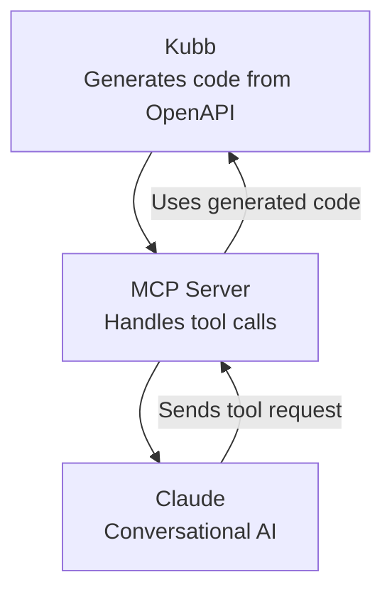

# @kubb/plugin-mcp

Generate [Model Context Protocol](https://modelcontextprotocol.io/introduction) servers that enable AI models to interact with your API.

This plugin creates an MCP server that tools like Claude or ChatGPT can use to call your API endpoints through text or voice commands.



> [!TIP]
> See [Setup Claude with Kubb](/guide/claude) for configuration instructions.

## Installation

::: code-group

```shell [bun]
bun add -d @kubb/plugin-mcp
```

```shell [pnpm]
pnpm add -D @kubb/plugin-mcp
```

```shell [npm]
npm install --save-dev @kubb/plugin-mcp
```

```shell [yarn]
yarn add -D @kubb/plugin-mcp
```

:::

## Options

### output
Specify the export location for the files and define the behavior of the output.

#### output.path

Path to the output folder or file that contains the generated code.

> [!TIP]
> if `output.path` is a file, `group` cannot be used.

|           |          |
|----------:|:---------|
|     Type: | `string` |
| Required: | `true`   |
|  Default: | `'ncp'`  |

#### output.barrelType

Specify what to export and optionally disable barrel file generation.

> [!TIP]
> Using propagate will prevent a plugin from creating a barrel file, but it will still propagate, allowing [`output.barrelType`](/getting-started/configure#output-barreltype) to export the specific function or type.

|           |                                 |
|----------:|:--------------------------------|
|     Type: | `'all' \| 'named' \| 'propagate' \| false` |
| Required: | `false`                         |
|  Default: | `'named'`                       |

<!--@include: ./core/barrelTypes.md-->

#### output.banner
Add a banner comment at the top of every generated file.

|           |                                       |
|----------:|:--------------------------------------|
|     Type: | `string \| (oas: Oas) => string` |
| Required: | `false`                               |

#### output.footer
Add a footer comment at the end of every generated file.

|           |                                       |
|----------:|:--------------------------------------|
|     Type: | `string \| (oas: Oas) => string` |
| Required: | `false`                               |

#### output.override
<!--@include: ./core/outputOverride.md-->

### contentType
<!--@include: ./core/contentType.md-->

### group
<!--@include: ./core/group.md-->

#### group.type
Specify the property to group files by.

|           |         |
|----------:|:--------|
|     Type: | `'tag'` |
| Required: | `true`  |

<!--@include: ./core/groupTypes.md-->

#### group.name

Return the name of a group based on the group name, this will be used for the file and name generation.

|           |                                     |
|----------:|:------------------------------------|
|     Type: | `(context: GroupContext) => string` |
| Required: | `false`                             |
|  Default: | `(ctx) => '${ctx.group}Requests'`   |


### client

#### client.importPath
<!--@include: ../plugin-client/importPath.md-->

#### client.dataReturnType
<!--@include: ../plugin-client/dataReturnType.md-->

#### client.baseURL
<!--@include: ../plugin-client/baseURL.md-->


### include
<!--@include: ./core/include.md-->

### exclude
<!--@include: ./core/exclude.md-->

### override
<!--@include: ./core/override.md-->

### generators 
<!--@include: ./core/generators.md-->

|           |                               |
|----------:|:------------------------------|
|     Type: | `Array<Generator<PluginMsw>>` |
| Required: | `false`                       |


### transformers
<!--@include: ./core/transformers.md-->

#### transformers.name
Customize the names based on the type that is provided by the plugin.

|           |                                                                               |
|----------:|:------------------------------------------------------------------------------|
|     Type: | `(name: string, type?: ResolveType) => string` |
| Required: | `false`                                                                       |

```typescript
type ResolveType = 'file' | 'function' | 'type' | 'const'
```

## Example

```typescript twoslash
import { defineConfig } from '@kubb/core'
import { pluginOas } from '@kubb/plugin-oas'
import { pluginTs } from '@kubb/plugin-ts'
import { pluginMcp } from '@kubb/plugin-mcp'
import { pluginZod } from '@kubb/plugin-zod'

export default defineConfig({
  input: {
    path: './petStore.yaml',
  },
  output: {
    path: './src/gen',
  },
  plugins: [
    pluginOas(),
    pluginTs(),
    pluginZod(),
    pluginMcp({
      output: {
        path: './mcp',
        barrelType: 'named',
      },
      client: {
        baseURL: 'https://petstore.swagger.io/v2',
      },
      group: {
        type: 'tag',
        name: ({ group }) => `${group}Handlers`,
      },
    }),
  ],
})
```
## See Also

- [MCP](https://modelcontextprotocol.io/)
- [Claude](https://claude.ai)
- [ChatGPT](https://openai.com/index/chatgpt/)
