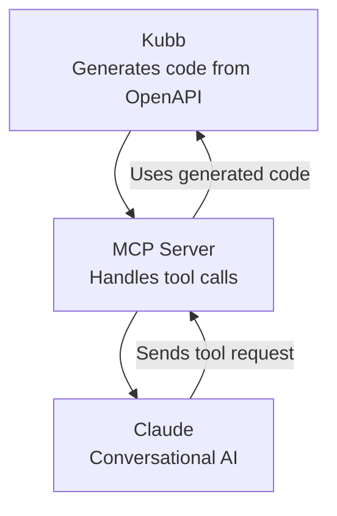

# @kubb/plugin-mcp

Generate [Model Context Protocol](https://modelcontextprotocol.io/introduction) servers that enable AI models to interact with your API.

This plugin creates an MCP server that tools like Claude or ChatGPT can use to call your API endpoints through text or voice commands.


```mermaid
graph TD
  A[Kubb<br/>Generates code from OpenAPI] --> B[MCP Server<br/>Handles tool calls]
  B --> C[Claude<br/>Conversational AI]
  C -->|Sends tool request| B
  B -->|Uses generated code| A
```

> [!TIP]
> See [Setup Claude with Kubb](/guide/claude) for configuration instructions.

## Installation

::: code-group

```shell [bun]
bun add -d @kubb/plugin-mcp
```

```shell [pnpm]
pnpm add -D @kubb/plugin-mcp
```

```shell [npm]
npm install --save-dev @kubb/plugin-mcp
```

```shell [yarn]
yarn add -D @kubb/plugin-mcp
```

:::

## Options

### output
Specify the export location for the files and define the behavior of the output.

#### output.path

<!--@include: ./core/outputPath.md-->

|           |           |
| --------: | :-------- |
|     Type: | `string`  |
| Required: | `true`    |
|  Default: | `'mcp'`   |

#### output.barrelType

<!--@include: ./core/outputBarrelType.md-->

#### output.banner

<!--@include: ./core/outputBanner.md-->

#### output.footer

<!--@include: ./core/outputFooter.md-->

#### output.override

<!--@include: ./core/outputOverride.md-->

### compatibilityPreset

<!--@include: ./core/compatibilityPreset.md-->

### resolver

<!--@include: ./core/resolvers.md-->

|           |                                                          |
| --------: | :------------------------------------------------------- |
|     Type: | `Partial<ResolverMcp> & ThisType<ResolverMcp>`           |
| Required: | `false`                                                  |

### group
<!--@include: ./core/group.md-->

#### group.type

<!--@include: ./core/groupType.md-->

#### group.name

Return the name of a group based on the group name, this will be used for the file and name generation.

|           |                                     |
| --------: | :---------------------------------- |
|     Type: | `(context: GroupContext) => string` |
| Required: | `false`                             |
|  Default: | `(ctx) => '${ctx.group}Requests'`   |

### paramsCasing

Transform parameter names to a specific casing format for path, query, and header parameters in generated MCP handlers.

> [!IMPORTANT]
> When using `paramsCasing`, ensure that `@kubb/plugin-ts` also has the same `paramsCasing` setting. This option automatically maps transformed parameter names back to their original API names in HTTP requests.

|           |                |
| --------: | :------------- |
|     Type: | `'camelcase'`  |
| Required: | `false`        |
|  Default: | `undefined`    |

- `'camelcase'` transforms parameter names to camelCase

::: code-group
```typescript [With paramsCasing: 'camelcase']
// Handler uses camelCase parameters
export async function findPetsByStatusHandler({ 
  stepId  // ✓ camelCase
}: { 
  stepId: FindPetsByStatusPathParams['stepId'] 
}): Promise<Promise<CallToolResult>> {
  // Automatically maps back to original name
  const step_id = stepId
  
  const res = await fetch({
    method: 'GET',
    url: `/pet/findByStatus/${step_id}`,  // Uses original API name
    ...
  })
  ...
}
```

```typescript [Without paramsCasing]
// Handler uses original API naming
export async function findPetsByStatusHandler({ 
  step_id  // Original naming
}: { 
  step_id: FindPetsByStatusPathParams['step_id'] 
}): Promise<Promise<CallToolResult>> {
  const res = await fetch({
    method: 'GET',
    url: `/pet/findByStatus/${step_id}`,
    ...
  })
  ...
}
```
:::

### client

#### client.importPath

<!--@include: ./plugin-client/importPath.md-->

#### client.dataReturnType

<!--@include: ./plugin-client/dataReturnType.md-->

#### client.baseURL

<!--@include: ./plugin-client/baseURL.md-->


### include
<!--@include: ./core/include.md-->

### exclude
<!--@include: ./core/exclude.md-->

### override
<!--@include: ./core/override.md-->

### generators 
<!--@include: ./core/generators.md-->

|           |                               |
| --------: | :---------------------------- |
|     Type: | `Array<Generator<PluginMcp>>` |
| Required: | `false`                       |

### transformer

<!--@include: ./core/transformers.md-->

## Example

```typescript twoslash
import { defineConfig } from '@kubb/core'
import { adapterOas } from '@kubb/adapter-oas'
import { pluginTs } from '@kubb/plugin-ts'
import { pluginZod } from '@kubb/plugin-zod'
import { pluginMcp } from '@kubb/plugin-mcp'

export default defineConfig({
  input: {
    path: './petStore.yaml',
  },
  output: {
    path: './src/gen',
  },
  adapter: adapterOas(),
  plugins: [
    pluginTs(),
    pluginZod(),
    pluginMcp({
      output: {
        path: './mcp',
        barrelType: 'named',
      },
      client: {
        baseURL: 'https://petstore.swagger.io/v2',
      },
      group: {
        type: 'tag',
        name: ({ group }) => `${group}Handlers`,
      },
    }),
  ],
})
```
## See Also

- [MCP](https://modelcontextprotocol.io/)
- [Claude](https://claude.ai)
- [ChatGPT](https://openai.com/index/chatgpt/)
