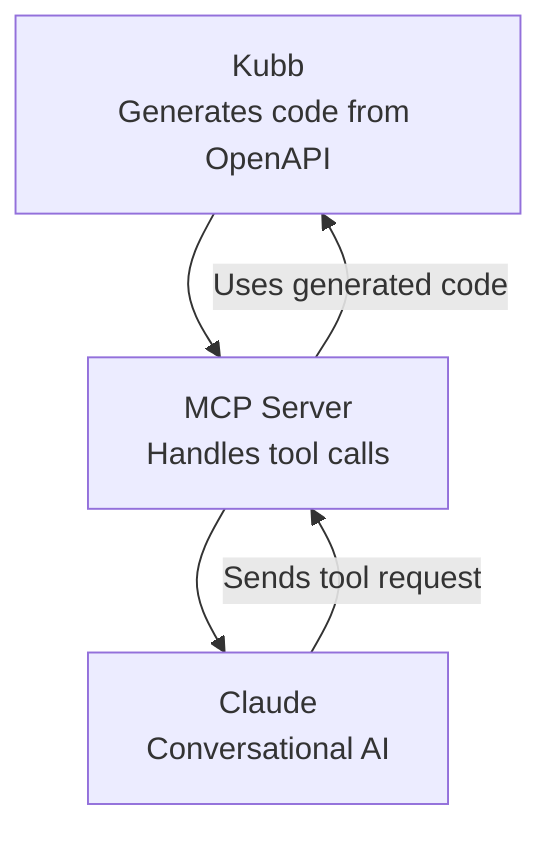

# @kubb/plugin-mcp

[MCP](https://modelcontextprotocol.io/introduction) brings AI-driven enhancements to your OpenAPI schema, this means that a tool like Claude or ChatGPT could interact with your api through the use of MCP.

This opens the doors to call API endpoints through the use of text of speak, MCP turns simple prompts into meaningful data based on your generated APIs.



> [!TIP]
> We provided a page in how you could set up Claude, see [Setup Claude with Kubb](/knowledge-base/claude).

## Installation

::: code-group

```shell [bun]
bun add -d @kubb/plugin-mcp
```

```shell [pnpm]
pnpm add -D @kubb/plugin-mcp
```

```shell [npm]
npm install --save-dev @kubb/plugin-mcp
```

```shell [yarn]
yarn add -D @kubb/plugin-mcp
```

:::

## Options

### output
Specify the export location for the files and define the behavior of the output.

#### output.path

Path to the output folder or file that will contain the generated code.

> [!TIP]
> if `output.path` is a file, `group` cannot be used.

|           |          |
|----------:|:---------|
|     Type: | `string` |
| Required: | `true`   |
|  Default: | `'ncp'`  |

#### output.barrelType

Define what needs to be exported, here you can also disable the export of barrel files.

> [!TIP]
> Using propagate will prevent a plugin from creating a barrel file, but it will still propagate, allowing [`output.barrelType`](/getting-started/configure#output-barreltype) to export the specific function or type.

|           |                                 |
|----------:|:--------------------------------|
|     Type: | `'all' \| 'named' \| 'propagate' \| false` |
| Required: | `false`                         |
|  Default: | `'named'`                       |

<!--@include: ../core/barrelTypes.md-->

#### output.banner
Add a banner text in the beginning of every file.

|           |                                       |
|----------:|:--------------------------------------|
|     Type: | `string \| (oas: Oas) => string` |
| Required: | `false`                               |

#### output.footer
Add a footer text at the end of every file.

|           |                                       |
|----------:|:--------------------------------------|
|     Type: | `string \| (oas: Oas) => string` |
| Required: | `false`                               |

### contentType
<!--@include: ../core/contentType.md-->

### group
<!--@include: ../core/group.md-->

#### group.type
Define a type where to group the files on.

|           |         |
|----------:|:--------|
|     Type: | `'tag'` |
| Required: | `true`  |

<!--@include: ../core/groupTypes.md-->

#### group.name

Return the name of a group based on the group name, this will be used for the file and name generation.

|           |                                     |
|----------:|:------------------------------------|
|     Type: | `(context: GroupContext) => string` |
| Required: | `false`                             |
|  Default: | `(ctx) => '${ctx.group}Requests'`   |


### client

#### client.importPath
<!--@include: ../plugin-client/importPath.md-->

#### client.dataReturnType
<!--@include: ../plugin-client/dataReturnType.md-->

#### client.baseURL
<!--@include: ../plugin-client/baseURL.md-->


### include
<!--@include: ../core/include.md-->

### exclude
<!--@include: ../core/exclude.md-->

### override
<!--@include: ../core/override.md-->

### generators 
<!--@include: ../core/generators.md-->

|           |                               |
|----------:|:------------------------------|
|     Type: | `Array<Generator<PluginMsw>>` |
| Required: | `false`                       |


### transformers
<!--@include: ../core/transformers.md-->

#### transformers.name
Customize the names based on the type that is provided by the plugin.

|           |                                                                               |
|----------:|:------------------------------------------------------------------------------|
|     Type: | `(name: string, type?: ResolveType) => string` |
| Required: | `false`                                                                       |

```typescript
type ResolveType = 'file' | 'function' | 'type' | 'const'
```

## Example

```typescript twoslash
import { defineConfig } from '@kubb/core'
import { pluginOas } from '@kubb/plugin-oas'
import { pluginTs } from '@kubb/plugin-ts'
import { pluginMcp } from '@kubb/plugin-mcp'
import { pluginZod } from '@kubb/plugin-zod'

export default defineConfig({
  input: {
    path: './petStore.yaml',
  },
  output: {
    path: './src/gen',
  },
  plugins: [
    pluginOas(),
    pluginTs(),
    pluginZod(),
    pluginMcp({
      output: {
        path: './mcp',
        barrelType: 'named',
      },
      client: {
        baseURL: 'https://petstore.swagger.io/v2',
      },
      group: {
        type: 'tag',
        name: ({ group }) => `${group}Handlers`,
      },
    }),
  ],
})
```
## Links

- [MCP](https://modelcontextprotocol.io/)
- [Claude](https://claude.ai)
- [ChatGPT](https://openai.com/index/chatgpt/)
