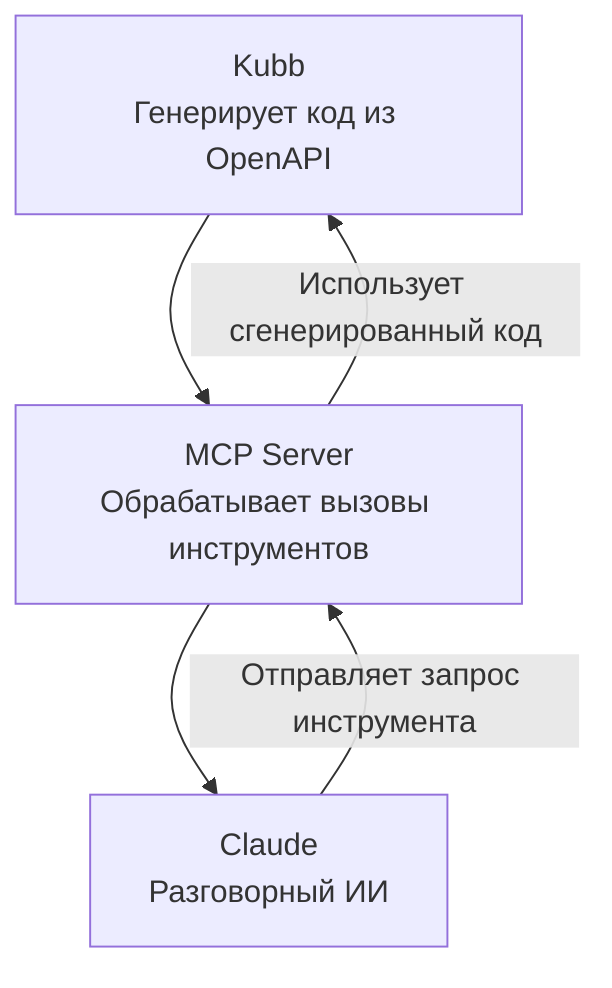

# @kubb/plugin-mcp

[MCP](https://modelcontextprotocol.io/introduction) привносит улучшения на основе ИИ в вашу OpenAPI схему, это означает, что такой инструмент, как Claude или ChatGPT, может взаимодействовать с вашим API через использование MCP.

Это открывает двери для вызова конечных точек API через использование текста или речи, MCP превращает простые подсказки в значимые данные на основе ваших сгенерированных API.



> [!TIP]
> Мы предоставили страницу о том, как настроить Claude, см. [Настройка Claude с Kubb](/ru/knowledge-base/claude).

## Установка

::: code-group

```shell [bun]
bun add -d @kubb/plugin-mcp
```

```shell [pnpm]
pnpm add -D @kubb/plugin-mcp
```

```shell [npm]
npm install --save-dev @kubb/plugin-mcp
```

```shell [yarn]
yarn add -D @kubb/plugin-mcp
```

:::

## Опции

### output
Укажите расположение экспорта файлов и определите поведение вывода.

#### output.path

Путь к выходной папке или файлу, который будет содержать сгенерированный код.

> [!TIP]
> если `output.path` является файлом, `group` не может использоваться.

|           |          |
|----------:|:---------|
|     Type: | `string` |
| Required: | `true`   |
|  Default: | `'ncp'`  |

#### output.barrelType

Определите, что необходимо экспортировать, здесь вы также можете отключить экспорт barrel файлов.

> [!TIP]
> Использование propagate предотвратит создание barrel файла плагином, но он все равно будет распространяться, позволяя [`output.barrelType`](/ru/getting-started/configure#output-barreltype) экспортировать конкретную функцию или тип.

|           |                                 |
|----------:|:--------------------------------|
|     Type: | `'all' \| 'named' \| 'propagate' \| false` |
| Required: | `false`                         |
|  Default: | `'named'`                       |

<!--@include: ../core/barrelTypes.md-->

#### output.banner
Добавьте текст баннера в начало каждого файла.

|           |                                       |
|----------:|:--------------------------------------|
|     Type: | `string \| (oas: Oas) => string` |
| Required: | `false`                               |

#### output.footer
Добавьте текст футера в конец каждого файла.

|           |                                       |
|----------:|:--------------------------------------|
|     Type: | `string \| (oas: Oas) => string` |
| Required: | `false`                               |

### contentType
<!--@include: ../core/contentType.md-->

### group
<!--@include: ../core/group.md-->

#### group.type
Определите тип, по которому группируются файлы.

|           |         |
|----------:|:--------|
|     Type: | `'tag'` |
| Required: | `true`  |

<!--@include: ../core/groupTypes.md-->

#### group.name

Возвращает имя группы на основе имени группы, это будет использоваться для генерации файла и имени.

|           |                                     |
|----------:|:------------------------------------|
|     Type: | `(context: GroupContext) => string` |
| Required: | `false`                             |
|  Default: | `(ctx) => '${ctx.group}Requests'`   |


### client

#### client.importPath
<!--@include: ../plugin-client/importPath.md-->

#### client.dataReturnType
<!--@include: ../plugin-client/dataReturnType.md-->

#### client.baseURL
<!--@include: ../plugin-client/baseURL.md-->


### include
<!--@include: ../core/include.md-->

### exclude
<!--@include: ../core/exclude.md-->

### override
<!--@include: ../core/override.md-->

### generators 
<!--@include: ../core/generators.md-->

|           |                               |
|----------:|:------------------------------|
|     Type: | `Array<Generator<PluginMsw>>` |
| Required: | `false`                       |


### transformers
<!--@include: ../core/transformers.md-->

#### transformers.name
Настройте имена на основе типа, предоставляемого плагином.

|           |                                                                               |
|----------:|:------------------------------------------------------------------------------|
|     Type: | `(name: string, type?: ResolveType) => string` |
| Required: | `false`                                                                       |

```typescript
type ResolveType = 'file' | 'function' | 'type' | 'const'
```

## Пример

```typescript twoslash
import { defineConfig } from '@kubb/core'
import { pluginOas } from '@kubb/plugin-oas'
import { pluginTs } from '@kubb/plugin-ts'
import { pluginMcp } from '@kubb/plugin-mcp'
import { pluginZod } from '@kubb/plugin-zod'

export default defineConfig({
  input: {
    path: './petStore.yaml',
  },
  output: {
    path: './src/gen',
  },
  plugins: [
    pluginOas(),
    pluginTs(),
    pluginZod(),
    pluginMcp({
      output: {
        path: './mcp',
        barrelType: 'named',
      },
      client: {
        baseURL: 'https://petstore.swagger.io/v2',
      },
      group: {
        type: 'tag',
        name: ({ group }) => `${group}Handlers`,
      },
    }),
  ],
})
```
## Ссылки

- [MCP](https://modelcontextprotocol.io/)
- [Claude](https://claude.ai)
- [ChatGPT](https://openai.com/index/chatgpt/)
