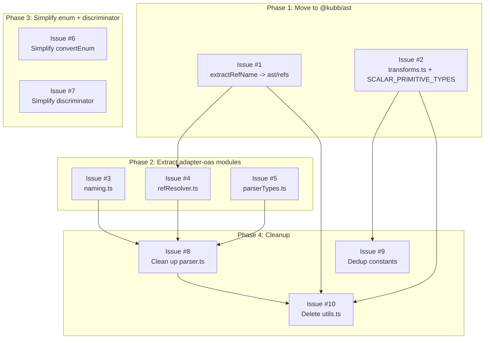

# adapter-oas / ast Refactoring Plan

This document breaks the refactoring into independent GitHub issues. Each issue is self-contained and can be assigned, branched, and merged independently (respecting the dependency chain).

---

## Phase 1 — Move Pure Helpers to `@kubb/ast`

No `adapter-oas` changes needed. These add new exports without breaking anything.

---

### Issue #1: Add `extractRefName` to `@kubb/ast`

**Labels:** `refactor`, `ast`, `good first issue`

**Files:** `packages/ast/src/refs.ts`, `packages/ast/src/refs.test.ts`, `packages/ast/src/index.ts`

**What:**
Move `extractRefName` from `adapter-oas/src/utils.ts:11-13` into `ast/src/refs.ts` alongside `buildRefMap`, `resolveRef`, `refMapToObject`. Export from `index.ts`.

**Why:**
`extractRefName` parses `$ref` strings — a generic ref operation with no OAS dependency. It belongs with the other ref utilities.

**Tests (add to `refs.test.ts`):**
- Extracts last segment from `#/components/schemas/Order` -> `'Order'`
- Extracts from response refs `#/components/responses/NotFound` -> `'NotFound'`
- Falls back to full string when no slash present

**Blocked by:** Nothing
**Blocks:** Issue #6

---

### Issue #2: Create `@kubb/ast/transforms.ts` with schema tree helpers

**Labels:** `refactor`, `ast`

**Files:** `packages/ast/src/transforms.ts`, `packages/ast/src/transforms.test.ts`, `packages/ast/src/constants.ts`, `packages/ast/src/index.ts`

**What:**
1. Move `SCALAR_PRIMITIVE_TYPES` from `adapter-oas/src/constants.ts` to `ast/src/constants.ts`.
2. Create `transforms.ts` with three functions copied from `adapter-oas/src/utils.ts`:
  - `applyDiscriminatorEnum({ node, propertyName, values, enumName? })` — replaces a property's schema with an enum on an ObjectSchemaNode.
  - `mergeAdjacentAnonymousObjects(members)` — merges consecutive unnamed ObjectSchemaNodes.
  - `simplifyUnionMembers(members)` — removes enum nodes subsumed by broader scalar types.
3. Export all from `index.ts`.

**Why:**
These functions operate exclusively on `SchemaNode` / `PropertyNode` with zero OAS dependency. They are pure AST tree transformations.

**Tests (create `transforms.test.ts`, 20 tests moved from `adapter-oas/src/utils.test.ts`):**

```
describe('applyDiscriminatorEnum')
  - returns node unchanged when it is not an object (existing)
  - returns node unchanged when the target property does not exist (existing)
  - returns node unchanged when properties are empty (existing)
  - replaces the discriminator property with an unnamed enum for a single value (existing)
  - replaces the discriminator property with a named enum for multiple values (existing)
  - preserves other properties when replacing the discriminator (existing)
  - preserves the enum primitive as string (existing)
  - preserves readOnly from the original property schema (existing)
  - preserves writeOnly from the original property schema (existing)

describe('mergeAdjacentAnonymousObjects')
  - returns an empty array unchanged (existing)
  - passes through a single anonymous object unchanged (existing)
  - merges two adjacent anonymous objects into one (existing)
  - merges three consecutive anonymous objects into one (existing)
  - does not merge named objects (existing)
  - does not merge across a named-object boundary (existing)
  - does not merge a ref node with an anonymous object (existing)

describe('simplifyUnionMembers')
  - returns members unchanged when no scalar primitives are present (existing)
  - removes string enum when a plain string is also present (existing)
  - keeps const-derived string enum when plain string is also present (existing)
  - keeps string enum when no broader string scalar is present (existing)
  - removes number enum when a plain number is also present (existing)
  - preserves ref members alongside scalar types (existing)
```

**Blocked by:** Nothing
**Blocks:** Issue #9

---

## Phase 2 — Extract New Modules in `adapter-oas`

These create new files by extracting functions from `parser.ts`. Each can be done independently.

---

### Issue #3: Create `naming.ts` — OAS name derivation

**Labels:** `refactor`, `adapter-oas`

**Files:** `packages/adapter-oas/src/naming.ts`, `packages/adapter-oas/src/naming.test.ts`, `packages/adapter-oas/src/parser.ts`

**What:**
Extract three naming functions from `parser.ts` closure into standalone exported functions:

- `resolveChildName(parentName, propName, isLegacyNaming)` (parser.ts:743-748)
- `resolveEnumPropName(parentName, propName, enumSuffix, isLegacyNaming, usedEnumNames)` (parser.ts:757-759)
- `applyEnumName(propNode, parentName, propName, enumSuffix, isLegacyNaming, usedEnumNames)` (parser.ts:767-781)

Make `isLegacyNaming` and `usedEnumNames` explicit parameters instead of closure-captured. Update `parser.ts` to import from `./naming.ts`.

**Why:**
These are closure-bound today, making them untestable in isolation. Extracting with explicit parameters enables unit testing and clarifies the legacy vs default naming strategies.

**Tests (`naming.test.ts`, ~14 tests):**

```
describe('resolveChildName')
  describe('default naming (isLegacyNaming: false)')
    - returns undefined when parentName is undefined
    - returns PascalCase of parentName + propName (e.g. 'Order', 'params' -> 'OrderParams')
    - handles multi-word property names (e.g. 'Order', 'shipping_address' -> 'OrderShippingAddress')

  describe('legacy naming (isLegacyNaming: true)')
    - returns PascalCase of propName only, ignoring parentName (e.g. 'Order', 'params' -> 'Params')
    - returns PascalCase even when parentName is undefined

describe('resolveEnumPropName')
  describe('default naming (isLegacyNaming: false)')
    - combines parentName, propName, and enumSuffix (e.g. 'Order', 'status', 'enum' -> 'OrderStatusEnum')
    - works without parentName (e.g. undefined, 'status', 'enum' -> 'StatusEnum')
    - handles custom enumSuffix (e.g. 'Order', 'status', 'Type' -> 'OrderStatusType')

  describe('legacy naming (isLegacyNaming: true)')
    - first call returns base name ('StatusEnum')
    - second call with same name appends 2 ('StatusEnum2')
    - third call appends 3 ('StatusEnum3')

describe('applyEnumName')
  describe('default naming (isLegacyNaming: false)')
    - assigns resolved name to enum node
    - strips name from boolean-primitive enum (always inlined)
    - passes through non-enum nodes unchanged

  describe('legacy naming (isLegacyNaming: true)')
    - uses deduplicated name via usedEnumNames
```

**Blocked by:** Nothing
**Blocks:** Issue #8

---

### Issue #4: Create `refResolver.ts` — ref walking and import resolution

**Labels:** `refactor`, `adapter-oas`

**Files:** `packages/adapter-oas/src/refResolver.ts`, `packages/adapter-oas/src/refResolver.test.ts`, `packages/adapter-oas/src/parser.ts`, `packages/adapter-oas/src/adapter.ts`

**What:**
Extract two functions into a new module:

- `resolveRefs(node, nameMapping, resolveName, resolveEnumName?)` from `parser.ts:1193-1214`. Change `nameMapping` from closure capture to explicit parameter.
- `getImports({ node, nameMapping, resolve })` from `utils.ts:145-168`. Already parameterized — just move.

Fix broken JSDoc on `getImports` (line 123 starts mid-sentence: `"nameMapping, and calls..."` — leftover from a previous edit).

Update `parser.ts` and `adapter.ts` to import from `./refResolver.ts`.

**Why:**
`resolveRefs` has zero test coverage today. Extracting it makes it testable. `getImports` is the only remaining function in `utils.ts` that isn't moving to `@kubb/ast`.

**Tests (`refResolver.test.ts`, 12 tests):**

```
describe('getImports')
  - returns empty array for non-ref node (move existing)
  - returns import for ref node when resolver returns result (move existing)
  - returns empty when resolver returns undefined (move existing)
  - applies nameMapping collision-resolved name before calling resolve (move existing)
  - collects imports from nested ref nodes inside object properties (NEW)
  - collects multiple imports from union members (NEW)
  - handles duplicate refs (NEW)

describe('resolveRefs')
  - resolves ref node name via resolveName callback (NEW)
  - applies nameMapping before calling resolveName (NEW)
  - resolves enum node name via resolveEnumName callback (NEW)
  - falls back to resolveName when resolveEnumName is not provided (NEW)
  - leaves non-ref, non-enum nodes unchanged (NEW)
  - handles nested refs inside object properties (NEW)
  - handles refs inside union members (NEW)
  - returns node unchanged when resolveName returns undefined (NEW)
```

**Blocked by:** Issue #1 (uses `extractRefName` from ast)
**Blocks:** Issue #8

---

### Issue #5: Create `parserTypes.ts` — type-level code

**Labels:** `refactor`, `adapter-oas`, `good first issue`

**Files:** `packages/adapter-oas/src/parserTypes.ts`, `packages/adapter-oas/src/parser.ts`

**What:**
Move type-level code from `parser.ts` lines 42-117 into a new `parserTypes.ts`:

- Remove duplicate `DistributiveOmit` — import from `@kubb/ast/types` instead
- `DateTimeNodeByDateType`
- `ResolveDateTimeNode`
- `SchemaNodeMap`
- `InferSchemaNode`

Update `parser.ts` to import from `./parserTypes.ts`.

**Why:**
75 lines of pure type-level inference logic does not belong in the runtime module. Makes the types reusable and reduces `parser.ts` line count.

**Blocked by:** Nothing
**Blocks:** Issue #8

---

## Phase 3 — Simplify Enum Generation and Discriminator Handling

These issues address the two areas identified as overly complex and hard to maintain.

---

### Issue #6: Simplify enum generation in `convertEnum`

**Labels:** `refactor`, `adapter-oas`, `code quality`

**Files:** `packages/adapter-oas/src/parser.ts`

**Problem:**
`convertEnum` (parser.ts:637-721) has four nearly identical exit branches that differ only in `enumType` and cast type. The `getPrimitiveType(type)` call is computed on line 651 (`enumPrimitive`) but then called three more redundant times on lines 672-676.

**What:**

1. **Use `enumPrimitive` instead of re-calling `getPrimitiveType(type)`** on lines 672-676:
   ```typescript
   // Before (3 redundant function calls):
   const enumType =
     getPrimitiveType(type) === 'number' || getPrimitiveType(type) === 'integer'
       ? ('number' as const)
       : getPrimitiveType(type) === 'boolean'
         ? ('boolean' as const)
         : ('string' as const)

   // After (use already-computed value):
   const enumType = (enumPrimitive === 'number' || enumPrimitive === 'integer')
     ? 'number' as const
     : enumPrimitive === 'boolean'
       ? 'boolean' as const
       : 'string' as const
   ```

2. **Merge the three non-string enum branches** (extension-key, numeric, boolean) into one. They all produce `namedEnumValues` — only the `enumType` and value cast differ:
   ```typescript
   // Unified non-string path: extension-key, numeric, and boolean enums
   if (extensionKey || enumPrimitive === 'number' || enumPrimitive === 'integer' || enumPrimitive === 'boolean') {
     const enumType = (enumPrimitive === 'number' || enumPrimitive === 'integer')
       ? 'number' as const
       : enumPrimitive === 'boolean'
         ? 'boolean' as const
         : 'string' as const

     const sourceValues = extensionKey
       ? [...new Set((schema as Record<string, unknown>)[extensionKey] as Array<string | number>)]
       : [...new Set(filteredValues)]

     return createSchema({
       ...enumBase,
       enumType,
       namedEnumValues: sourceValues.map((label, index) => ({
         name: String(label),
         value: extensionKey ? (filteredValues[index] ?? label) : label,
         format: enumType,
       })),
     })
   }
   ```

3. **Extract the array-enum normalization** (lines 639-644) into a small helper to make the main function body cleaner:
   ```typescript
   function normalizeArrayEnum(schema: SchemaObject): SchemaObject {
     const isItemsObject = typeof schema.items === 'object' && !Array.isArray(schema.items)
     const normalizedItems = { ...(isItemsObject ? (schema.items as SchemaObject) : {}), enum: schema.enum }
     const { enum: _enum, ...rest } = schema
     return { ...rest, items: normalizedItems } as SchemaObject
   }
   ```

**Reduction:** ~85 lines -> ~45 lines (nearly half).

**Verify:** All existing `convertSchema enum` tests (parser.test.ts lines 1632-1815) pass without changes. This is a pure internal refactor.

**Blocked by:** Nothing
**Blocks:** Nothing (can merge independently)

---

### Issue #7: Simplify discriminator handling with `createDiscriminantNode` helper

**Labels:** `refactor`, `adapter-oas`, `code quality`

**Files:** `packages/adapter-oas/src/parser.ts`, `packages/adapter-oas/src/utils.ts` (or `@kubb/ast/transforms.ts` after Issue #2)

**Problem:**
The discriminator pattern — "create a single-property object with an enum of one value for the discriminant" — is hand-built in **three separate places** with nearly identical code:

1. **`convertAllOf`** (lines 427-445): injects `{ type: 'cat' }` into allOf members when circular parent is filtered.
2. **`convertUnion` with properties** (lines 486-501): narrows the discriminant per union member via `applyDiscriminatorEnum`.
3. **`convertUnion` without properties** (lines 508-541): builds the `{ type: 'cat' }` object inline per member.

The discriminator value lookup (`Object.entries(mapping).find(([, v]) => v === ref)?.[0]`) is also duplicated three times (lines 383, 488, 514).

**What:**

1. **Create `createDiscriminantNode(propertyName, value)` helper** that builds the synthetic `{ propertyName: enum(value) }` object node. This replaces the 12-line inline construction used in `convertAllOf` (lines 429-444) and `convertUnion` (lines 519-533):

   ```typescript
   function createDiscriminantNode(propertyName: string, value: string): SchemaNode {
     return createSchema({
       type: 'object',
       primitive: 'object',
       properties: [
         createProperty({
           name: propertyName,
           schema: createSchema({
             type: 'enum',
             primitive: 'string',
             enumValues: [value],
           }),
           required: true,
         }),
       ],
     })
   }
   ```

   Place this in `@kubb/ast/transforms.ts` (if Issue #2 is done) or keep it local in `parser.ts`. It's a pure AST factory with no OAS dependency.

2. **Create `resolveDiscriminatorValue(mapping, ref)` helper** that encapsulates the mapping lookup:

   ```typescript
   function resolveDiscriminatorValue(
     mapping: Record<string, string> | undefined,
     ref: string | undefined,
   ): string | undefined {
     if (!mapping || !ref) return undefined
     return Object.entries(mapping).find(([, v]) => v === ref)?.[0]
   }
   ```

   Place in `parser.ts` (OAS-specific concern).

3. **Unify the two `convertUnion` discriminator branches** (with-properties and without-properties). Both do the same thing — map each union member to an intersection of `memberNode & discriminantNode` — but the with-properties path uses `applyDiscriminatorEnum` while without-properties builds the node inline. After the helpers above, the two branches collapse into one:

   ```typescript
   if (discriminator?.mapping) {
     return createSchema({
       type: 'union',
       ...unionBase,
       members: unionMembers.map((s) => {
         const ref = isReference(s) ? s.$ref : undefined
         const value = resolveDiscriminatorValue(discriminator.mapping, ref)
         const memberNode = convertSchema({ schema: s as SchemaObject }, options)

         if (!value) return memberNode

         const narrowedProperties = schema.properties
           ? applyDiscriminatorEnum({ node: sharedPropertiesNode, propertyName: discriminator.propertyName, values: [value] })
           : createDiscriminantNode(discriminator.propertyName, value)

         return createSchema({
           type: 'intersection',
           members: [memberNode, narrowedProperties],
         })
       }),
     })
   }
   ```

**Reduction:** `convertUnion` drops from 86 lines to ~45. `convertAllOf` discriminant injection drops from 18 lines to 5. Total: ~54 lines saved. More importantly, the logic is now uniform and easier to extend (e.g., supporting `x-discriminator-value` or nested discriminators in the future).

**Tests:**
All existing discriminator tests (6 describes, 12 tests) must pass unchanged:
- `convertSchema object discriminator` (3 tests)
- `convertSchema discriminator on union (oneOf/anyOf)` (5 tests)
- `convertSchema discriminator on union without sibling properties` (3 tests)
- `convertSchema circular allOf discriminator detection` (2 tests)

Additionally, add tests for the new helpers:

```
describe('createDiscriminantNode')
  - creates an object with a single required enum property
  - enum has exactly one value matching the input
  - property name matches the input

describe('resolveDiscriminatorValue')
  - returns the mapping key when ref matches a value
  - returns undefined when ref does not match any value
  - returns undefined when mapping is undefined
  - returns undefined when ref is undefined
```

**Blocked by:** Nothing (can be done standalone, or after Issue #2 for optimal placement)
**Blocks:** Nothing

---

## Phase 4 — Internal Cleanup

---

### Issue #8: Clean up `parser.ts` internals

**Labels:** `refactor`, `adapter-oas`

**Files:** `packages/adapter-oas/src/parser.ts`

**What:**
1. **Replace `resolveTypeOption`** if-chain with a `TYPE_OPTION_MAP` constant lookup:
   ```typescript
   const TYPE_OPTION_MAP: Record<'any' | 'unknown' | 'void', ScalarSchemaType> = {
     any: schemaTypes.any,
     unknown: schemaTypes.unknown,
     void: schemaTypes.void,
   }
   ```

2. **Rename `SchemaContext` fields** for clarity:
  - `options` -> `rawOptions` (the unmerged `Partial<ParserOptions>`)
  - `mergedOptions` -> `options` (the fully resolved `ParserOptions`)

3. **Update all imports** to use the new modules (`naming.ts`, `refResolver.ts`, `parserTypes.ts`, `@kubb/ast/transforms`).

**Verify:** All 300 `parser.test.ts` tests pass.

**Blocked by:** Issues #3, #4, #5 (the modules being imported must exist)
**Blocks:** Issue #10

---

### Issue #9: Deduplicate constants

**Labels:** `refactor`, `adapter-oas`, `good first issue`

**Files:** `packages/adapter-oas/src/constants.ts`, `packages/adapter-oas/src/parser.ts`, `packages/adapter-oas/src/oas/types.ts`

**What:**
1. **Remove `knownMediaTypes`** Set — derive from `mediaTypes` in `@kubb/ast`:
   ```typescript
   import { mediaTypes } from '@kubb/ast'
   export const knownMediaTypes = new Set(Object.values(mediaTypes))
   ```
2. **Remove `httpMethods`** — resolve the existing `TODO(v5): remove`. Use `httpMethods` from `@kubb/ast`. Update the single re-export in `oas/types.ts`.
3. **Remove `SCALAR_PRIMITIVE_TYPES`** — already moved to `@kubb/ast` in Issue #2.

**Blocked by:** Issue #2
**Blocks:** Nothing

---

### Issue #10: Delete `utils.ts` and `utils.test.ts`

**Labels:** `refactor`, `adapter-oas`, `good first issue`

**Files:** `packages/adapter-oas/src/utils.ts`, `packages/adapter-oas/src/utils.test.ts`

**What:**
All functions have been moved. Delete both files.

| Function | New location |
|---|---|
| `extractRefName` | `@kubb/ast/refs.ts` (Issue #1) |
| `applyDiscriminatorEnum` | `@kubb/ast/transforms.ts` (Issue #2) |
| `mergeAdjacentAnonymousObjects` | `@kubb/ast/transforms.ts` (Issue #2) |
| `simplifyUnionMembers` | `@kubb/ast/transforms.ts` (Issue #2) |
| `getImports` | `adapter-oas/src/refResolver.ts` (Issue #4) |

| Test section | New location |
|---|---|
| `extractRefName` (3 tests) | `ast/src/refs.test.ts` (Issue #1) |
| `applyDiscriminatorEnum` (8 tests) | `ast/src/transforms.test.ts` (Issue #2) |
| `mergeAdjacentAnonymousObjects` (7 tests) | `ast/src/transforms.test.ts` (Issue #2) |
| `simplifyUnionMembers` (5 tests) | `ast/src/transforms.test.ts` (Issue #2) |
| `getImports` (4 tests) | `adapter-oas/src/refResolver.test.ts` (Issue #4) |

**Verify:** `pnpm build && pnpm typecheck && pnpm test` passes.

**Blocked by:** Issues #1, #2, #4, #8
**Blocks:** Nothing

---

## Dependency Graph



## Parallelism

These groups can run concurrently:

| Parallel lane | Issues |
|---|---|
| Lane A | #1, then #4 |
| Lane B | #2 |
| Lane C | #3 |
| Lane D | #5 |
| Lane E | #6 (independent) |
| Lane F | #7 (independent) |

After lanes A-D complete: #8, #9
After #8: #10

## Summary

| Issue | Files changed | Tests | Lines saved |
|---|---|---|---|
| #1 extractRefName to ast | 3 | 3 moved | 0 (additive) |
| #2 transforms.ts | 4 | 20 moved | 0 (additive) |
| #3 naming.ts | 3 | 14 new | ~30 from parser.ts |
| #4 refResolver.ts | 4 | 4 moved + 8 new | ~30 from parser.ts |
| #5 parserTypes.ts | 2 | 0 (types only) | ~75 from parser.ts |
| #6 Simplify enum | 1 | 0 (existing cover) | ~40 from parser.ts |
| #7 Simplify discriminator | 1-2 | 7 new | ~54 from parser.ts |
| #8 parser.ts cleanup | 1 | 0 (existing cover) | ~10 from parser.ts |
| #9 Dedup constants | 3 | 0 | ~30 from constants.ts |
| #10 Delete utils | 2 | 0 (all moved) | ~170 deleted |
| **Total** | | **27 moved + 29 new = 56** | **~440 lines** |

`parser.ts` goes from **1222 lines to ~980** after phases 2-3, to **~750** after phase 4 cleanup and import consolidation.
